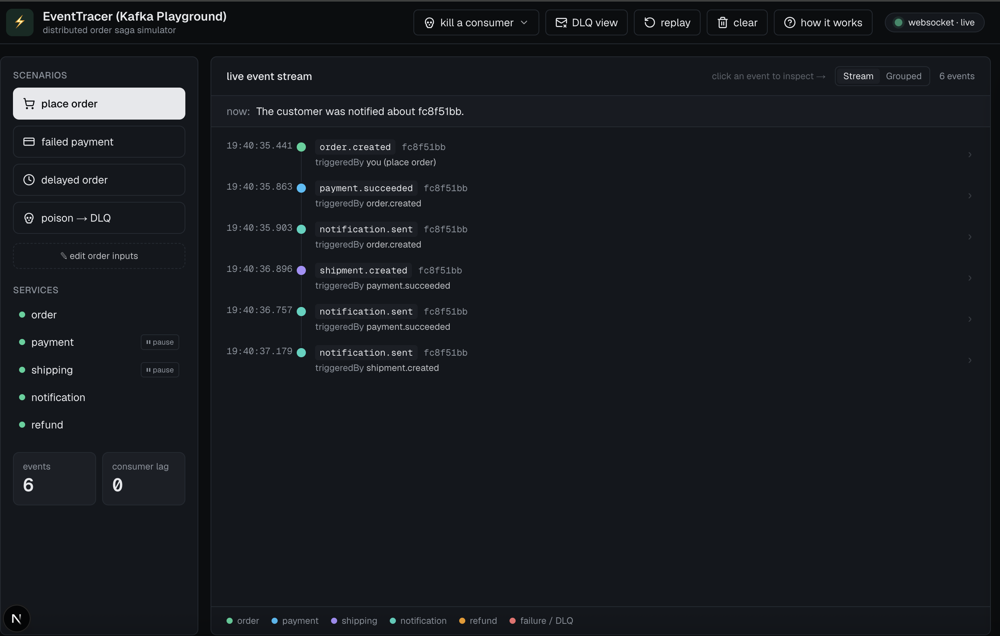

# EventTracer

A distributed order-processing simulator that makes **event-driven architecture visible**.
Click a scenario and watch an order saga propagate through Kafka — published, consumed,
compensated, dead-lettered, replayed — streamed to the browser in real time.

It is **not** a real e-commerce platform. It is a simulator whose product is the *live
visualization* of how independent services choreograph through an event log.

---


## Why it exists

Most backends say "we use Kafka." Few can *show* what actually happens between services.
EventTracer turns the normally-invisible event flow into something you can watch, pause on,
and explain — including the failure modes that separate a tutorial from real distributed-
systems understanding: **compensation, consumer lag, dead-letter queues, idempotency, and
replay**. It's built as a learning / portfolio project to demonstrate those patterns end to
end, from the broker to the browser.

## What it demonstrates

- **Choreographed saga** across five domain services with **no central orchestrator** — each
  service simply reacts to events.
- **Command/event split** — the browser issues **commands** over HTTP; **events** stream back
  over a WebSocket. The browser never touches Kafka.
- **Transactional outbox** — reliable publishing without the dual-write problem.
- **Decoupled observability** — a dedicated Event Monitor is "just another consumer," so the
  domain services know nothing about the UI.
- **Resilience patterns**, each as a one-click scenario:
  - **Failed payment → refund** (compensating transaction)
  - **Delayed processing** (watch consumer lag rise, then drain)
  - **Kill / pause a consumer** (events buffer as lag, then catch up on resume)
  - **Poison message → dead-letter queue**
  - **Idempotent redelivery** (no double-charge on a duplicate event)
  - **Replay** (rebuild the whole timeline from the log, read-only)

## Screens & UI features

A Next.js dashboard renders the live system:

- **Command panel** — scenario buttons with editable, regenerable order inputs (proving the
  values are real, not hardcoded).
- **Service health** — per-service status dots (up / paused / down) and consumer lag; payment
  and shipping consumers can be paused/resumed straight from the UI.
- **Live timeline** — every event with its type, correlation id, causal `triggeredBy`, and a
  plain-English narration of what just happened. Toggle a flat **stream** or **grouped-by-saga**
  view, filter to **DLQ** only, and click any event to read its full **published envelope JSON**.
- **A "how it works" guide**, a 300-word explainer footer, and event-family color coding.

## Architecture

```
Browser UI ──POST /orders, /control/... (HTTP)──▶ API Gateway ──▶ Order Service
   ▲                                                                 │ writes order + outbox (1 tx)
   │ WebSocket (events out)                                          ▼ relay publishes
   │                                              ┌──── Kafka event log (KRaft) ────┐
Event Monitor ◀── consumes all topics ───────────┤  order.created                   │
                                                  │  payment.succeeded / .failed     │
                                                  │  shipment.created                │
                                                  │  refund.initiated                │
                                                  │  notification.sent               │
                                                  │  <topic>.DLQ                     │
                                                  └──┬────────┬─────────┬─────────┬──┘
                                              Payment   Shipping   Notification  Refund
```

The browser sends **commands**; services react to **events**. Kafka runs in **KRaft mode**
(no Zookeeper). Every decision is recorded in [`ARD.md`](./ARD.md).

## Services

| Service | Role |
|---|---|
| **API Gateway** | Only public HTTP entry; accepts commands (`POST /orders`, `/orders/:id/redeliver`, `/control/:service/:action`) |
| **Order** | Creates orders, publishes `order.created` via the outbox |
| **Payment** | Consumes `order.created`; publishes `payment.succeeded` / `payment.failed` (deterministic, seeded) |
| **Shipping** | Consumes `payment.succeeded`; publishes `shipment.created` |
| **Notification** | Consumes customer-facing events; emits `notification.sent` (email/SMS sim) |
| **Refund** | Consumes `payment.failed`; runs the compensation saga (`refund.initiated`) |
| **Event Monitor** | Consumes all topics + the control plane; streams everything to the UI over WebSocket; serves `POST /replay` |

## Tech stack

**Backend:** TypeScript · NestJS (monorepo, Kafka microservice transport) · Apache Kafka (KRaft)
· PostgreSQL (schema per service) · TypeORM.
**Frontend:** Next.js (App Router) · React · TypeScript · Tailwind CSS · socket.io-client · lucide-react.
**Infra:** Docker Compose.

## Key architectural decisions

The full rationale lives in [`ARD.md`](./ARD.md). In brief:

| # | Decision | Why |
|---|---|---|
| 001 | Commands over HTTP, never direct Kafka from the browser | Trust boundary + protocol reality |
| 002 | Events reach the UI only via the Event Monitor → WebSocket | Decouple observability from the domain |
| 003 | Choreographed saga (no orchestrator) | Showcase event-driven flow; refund = compensation |
| 004 | Transactional outbox for all publishing | Solve the dual-write problem |
| 005 | Kafka in KRaft mode | Current standard, fewer moving parts |
| 006 | At-least-once delivery + idempotent consumers | Correct under redelivery |
| 007 | Dead-letter queue for poison messages | Survive un-processable messages |
| 008 | PostgreSQL schema per service | Data ownership in one container |
| 009 | NestJS monorepo, one app per service | Shared contracts, independent services |
| 010 | Docker Compose for local orchestration | One-command startup |
| 011 | Notification publishes `notification.sent` | Make the notify step visible in the UI |
| 012 | Read-only replay from the log | Rebuild the timeline without re-triggering the saga |
| 013 | Redeliver the identical event from its owner | Prove idempotency: no second charge |
| 014 | Kill-a-consumer = reversible pause via a control topic | One-click pause/resume; lag builds then drains |

## Project structure

```
apps/
  api-gateway/           # only public HTTP entry
  order-service/  payment-service/  shipping-service/
  notification-service/  refund-service/
  event-monitor/         # consumes all topics → WebSocket
libs/
  events/                # shared event envelopes + topic/command names
  kafka/                 # DLQ helper + consumer pause/resume control
  outbox/                # outbox entity + relay
  persistence/           # shared TypeORM naming strategy
frontend/                # Next.js + Tailwind dashboard (own package.json)
initdb/                  # Postgres per-service schema bootstrap
```

## Getting started

**Prerequisites:** Docker (with Compose) and Node.js 22+.

### Option A — everything in Docker (simplest)

```bash
make up-all          # builds + starts infra, all 7 services, and the frontend
# then open:
make ui              # http://localhost:3001
```

Tear down with `make down` (keep data) or `make down-v` (also reset Kafka log + DB).

### Option B — host dev with hot reload

Run the infrastructure in Docker and the apps on your machine:

```bash
make up                       # kafka + postgres only

# each in its own terminal:
make api-gateway-dev          # :5000
make event-monitor-service-dev# :4000
make order-service-dev
make payment-service-dev
make shipping-service-dev
make notification-service-dev
make refund-service-dev

# the UI:
make frontend-install         # first time only
make frontend-dev             # http://localhost:3001
```

> The frontend reads `NEXT_PUBLIC_GATEWAY_URL` (default `http://localhost:5000`) and
> `NEXT_PUBLIC_MONITOR_URL` (default `http://localhost:4000`); the defaults work out of the box.

## Using it

Open **http://localhost:3001** and try, in order:

1. **Place order** — watch `order.created → payment.succeeded → shipment.created → notification.sent`.
2. **Failed payment** — see the refund compensation branch instead.
3. **Kill a consumer** (top bar) — pause *shipping*, place a succeeding order, watch its lag climb
   with no shipment, then **resume** and watch it drain.
4. **Poison → DLQ**, then toggle **DLQ view** to isolate the dead-letter.
5. **Replay** — the board rebuilds from the Kafka log (read-only, dimmed rows).

Click any event to inspect its raw envelope; switch **stream / grouped** to see sagas as cards.

## Ports

| Port | Service |
|---|---|
| 3001 | Frontend (Next.js) |
| 5000 | API Gateway (REST) |
| 4000 | Event Monitor (WebSocket + `/replay`) |
| 9092 | Kafka (host listener) |
| 5432 | PostgreSQL |

## Make targets

`make help` lists everything. Highlights: `up` / `up-all` / `down` / `down-v`, the per-service
`*-dev` targets, `frontend-dev` / `frontend-build`, `build` / `lint` / `test`, and the
`kafka-topics` / `kafka-groups` / `db-schemas` helpers.

## Documentation

- [`specs.md`](./specs.md) — what we're building: services, topics, UI, scenarios, milestones.
- [`ARD.md`](./ARD.md) — architecture decision records: the *why* behind each choice.
- [`CLAUDE.md`](./CLAUDE.md) — working agreement and the inviolable architectural rules.

## License

UNLICENSED — portfolio / educational project by Martin Oputa.
